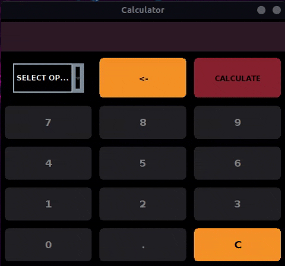

<div align="center">
  
</div>

> *Do simple calculations with this fully functional calculator* 😊


---

This project was developed for the **Programming 1 class**, in the **Computer Information Systems** course 
at **Goiás State University**

### 💬 Purpose
The purpose of this simple project was to know the main functions of Java Swing...
- Manipulate and style graphic elements of the Layout
- Generate actions on buttons
- Practice the separation of responsibilities 
- Create an architecture for development

> The calculator has this different layout proposed by the teacher,
 since there are already many calculators made in Java.
---
### 📁 How to download and run this project
> First, clone this repository
```
$ git clone https://github.com/juliocesarfs/java-calculator.git
```

After cloning the repository, **just run App.java**.

# 📕 License

This project is under the [MIT license](https://github.com/Crucciatus/java-calculator/blob/master/LICENSE)

Made with 💜 by [*Júlio César*](https://github.com/juliocesarfs) 🚀


